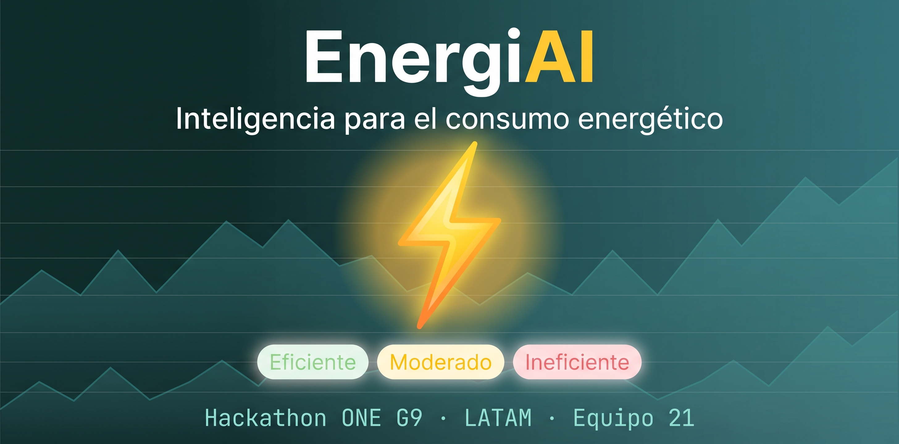

# EnergiAI — Inteligencia para el Consumo Energético ⚡



---

## Insignias


---

## Índice

- [Descripción del Proyecto](#-Descripción-del-Proyecto)
- [Estado del Proyecto](#-estado-del-proyecto)
- [Demostración de Funciones y Aplicaciones](#-demostración-de-funciones-y-aplicaciones)
- [Acceso al Proyecto](#-acceso-al-proyecto)
- [Tecnologías Utilizadas](#-tecnologías-utilizadas)
- [Personas Contribuyentes](#-personas-contribuyentes)
- [Personas Desarrolladoras del Proyecto](#-personas-desarrolladoras-del-proyecto)
- [Licencia](#-licencia)

---

## 📖 Descripción del Proyecto

**EnergiAI** es una solución inteligente diseñada para analizar patrones de consumo de energía eléctrica y generar información clave que apoye la toma de decisiones sobre eficiencia energética.

Muchos usuarios reciben facturas de energía elevadas sin visibilidad clara sobre qué hábitos impactan más en sus gastos. EnergiAI transforma datos de consumo en información útil y comprensible:

1. **Clasifica el perfil energético** del usuario mediante un modelo de machine learning:
   - 🟢 **Eficiente**
   - 🟡 **Moderado**
   - 🔴 **Ineficiente**
2. **Genera recomendaciones personalizadas** para reducir el desperdicio energético y adoptar hábitos más sostenibles.
3. **Estima el impacto financiero** del consumo con una tarifa de referencia de **$0.75 por kWh**.
4. **Alerta climática preventiva**: si la temperatura actual de la región (vía OpenWeatherMap) supera los 32 °C, sugiere minimizar el uso de equipos de alto consumo.

### Arquitectura

```
Cliente (navegador / Postman)
        │  POST /analisis-energetico
        ▼
┌──────────────────────────┐     POST /analisis-energetico    ┌──────────────────────────┐
│  backend-api             │ ───────────────────────────────▶ │  ia-service              │
│  Spring Boot (:8080)     │ ◀─────────────────────────────── │  FastAPI (:8000)         │
│  - valida entrada        │    {categoria, probabilidad}     │  - modelo GradientBoost. │
│  - autenticación JWT     │                                  │  - recomendaciones       │
│  - guarda historial (BD) │                                  │  - alerta climática      │
└──────────────────────────┘                                  └──────────────────────────┘
        │
        ▼
   MySQL 8.0 (:3307)          
```

Desarrollado como **MVP para el Hackathon ONE G9 (LATAM), Equipo 21**.

---

## 🚧 Estado del Proyecto

✅ **MVP completado — Hackathon ONE G9**

- [x] Modelo entrenado, evaluado y comparado (3 algoritmos, registro en MLflow)
- [x] Clasificación funcional del consumo con probabilidad
- [x] Generación automática de recomendaciones
- [x] Estimación del costo energético en la respuesta
- [x] API REST documentada (Swagger/OpenAPI)
- [x] Autenticación JWT + modo invitado
- [x] Historial de análisis persistido en MySQL
- [x] Alerta climática real (OpenWeatherMap) con fallback no bloqueante
- [x] Contenedorización completa con Docker Compose
- [x] Pruebas automatizadas (9 tests del servicio de IA + tests del backend)

---

## 🎯 Demostración de Funciones y Aplicaciones

### Funcionalidades

- `Análisis de consumo`: envía los datos de consumo de una vivienda o local y recibe la clasificación del perfil energético con su probabilidad.
- `Recomendaciones personalizadas`: sugerencias de ahorro generadas automáticamente según los datos ingresados.
- `Estimación de costo`: cálculo del costo mensual estimado con tarifa de referencia de $0.75/kWh.
- `Alerta climática`: recomendación preventiva cuando la temperatura de la región supera los 32 °C.
- `Historial`: consulta de análisis anteriores por usuario (con autenticación) o en modo invitado.
- `Dashboard web`: interfaz para ingresar datos y visualizar resultados con gráficas.

### Ejemplo de uso — `POST /analisis-energetico`

**Petición (perfil ineficiente):**

```bash
curl -X POST http://localhost:8080/analisis-energetico \
  -H "Content-Type: application/json" \
  -d '{
    "consumo_kwh": 420,
    "uso_horario_pico": true,
    "cantidad_equipos": 10,
    "tipo_inmueble": "Casa",
    "horas_alto_consumo": 8
  }'
```

**Respuesta:**

```json
{
  "categoria": "Ineficiente",
  "probabilidad": 0.81,
  "recomendaciones": [
    "Reducir el uso de equipos durante los horarios pico",
    "Evaluar equipos con alto consumo energético",
    "Distribuir las actividades de mayor consumo a lo largo del día"
  ],
  "costo_estimado_mensual": 315.00,
  "id_analisis": "a91f3c2e-88b1-4e0a-9c7d-3f2b1e0a9d1c",
  "fecha": "2026-08-16"
}
```

### Casos de prueba listos

| Caso | `consumo_kwh` | `uso_horario_pico` | `cantidad_equipos` | `tipo_inmueble` | `horas_alto_consumo` | Resultado esperado |
|---|---|---|---|---|---|---|
| 1 | 90 | false | 3 | Apartamento | 1 | 🟢 Eficiente |
| 2 | 250 | true | 6 | Casa | 4 | 🟡 Moderado |
| 3 | 620 | true | 14 | Casa Grande | 10 | 🔴 Ineficiente |

Más ejemplos y casos de error en [backend/backend-api/EJEMPLOS_USO.md](backend/backend-api/EJEMPLOS_USO.md).

### Documentación interactiva de la API

| Servicio | URL |
|---|---|
| Backend (Swagger UI) | `http://localhost:8080/swagger-ui.html` |
| Servicio de IA (OpenAPI) | `http://localhost:8000/docs` |

---

## 📁 Acceso al Proyecto

Puedes clonar el repositorio con:

```bash
git clone https://github.com/No-Country-simulation/G9-LATAM-TEAM-21-EnergiAI.git
cd G9-LATAM-TEAM-21-EnergiAI
```

### Estructura

```
G9-LATAM-TEAM-21-EnergiAI/
├── backend/backend-api/     # API pública — Java 17 + Spring Boot
├── data-science/energia_mvp/  # Servicio de IA — Python + FastAPI + modelo ML
├── frontend/                # Interfaz web (HTML/CSS/JS + Chart.js, servida por Nginx)
├── docs/                    # Documentación e imágenes
├── docker-compose.yml       # Orquesta los 4 servicios
└── docker-compose.dev.yml   # Entorno de desarrollo
```

### 🐳 Ejecutar con Docker (recomendado)

```bash
docker compose up --build
```

| Servicio | URL |
|---|---|
| Frontend | `http://localhost` |
| Backend API | `http://localhost:8080` |
| Servicio de IA | `http://localhost:8000` |
| MySQL | `localhost:3307` |

Variables de entorno opcionales (archivo `.env`): `JWT_SECRET`, `JWT_ISSUER`, `OPENWEATHER_API_KEY`, `DB_PASSWORD`, `DB_NAME`, `DB_USER`.

### 💻 Ejecutar localmente sin Docker

**Servicio de IA** (requiere Python 3.11):

```bash
cd data-science/energia_mvp
python -m venv venv && source venv/bin/activate
pip install -r requirements.txt
uvicorn api.main:app --reload --port 8000
```

**Backend** (requiere Java 17 + Maven y MySQL corriendo):

```bash
cd backend/backend-api
mvn spring-boot:run
```

**Tests:**

```bash
# Servicio de IA
cd data-science/energia_mvp && pytest tests/test_api.py -v

# Backend
cd backend/backend-api && mvn test
```

---

## 🛠 Tecnologías Utilizadas

| Capa | Tecnologías |
|---|---|
| **Ciencia de Datos** | Python 3.11, Pandas, NumPy, Scikit-Learn, XGBoost, MLflow, Joblib |
| **Servicio de IA** | FastAPI, Uvicorn, Pydantic |
| **Back-End** | Java 17, Spring Boot 3.2 (Web, Data JPA, Security, Validation), Flyway, java-jwt, Lombok |
| **Base de Datos** | MySQL 8.0 (H2 para tests) |
| **Front-End** | HTML5, CSS3, JavaScript, Chart.js, Nginx |
| **Infraestructura** | Docker, Docker Compose|
| **Integraciones externas** | OpenWeatherMap (alerta climática) |
| **Calidad** | JUnit, pytest, JaCoCo, CI con gate de calidad (`f1_macro` mínimo 0.55) |

### Modelo de Machine Learning

Se compararon 3 algoritmos sobre 100,000 registros sintéticos con 15 variables:

| Algoritmo | Accuracy | F1-macro |
|---|---|---|
| RandomForest | 0.593 | 0.591 |
| **GradientBoosting (seleccionado)** | **0.599** | **0.596** |
| XGBoost | 0.597 | 0.592 |

El experimento completo está documentado en `data-science/energia_mvp/notebooks/evaluacion_modelo_v3.ipynb` y registrado en MLflow.

---

## 👥 Personas Contribuyentes

Agradecemos a todas las personas que contribuyeron a este proyecto:

[](https://github.com/No-Country-simulation/G9-LATAM-TEAM-21-EnergiAI/graphs/contributors)

---

## 👨‍💻 Personas Desarrolladoras del Proyecto

Proyecto desarrollado por el **Equipo 21 — G9 LATAM** del Hackathon ONE:

| Nombre | GitHub |
|---|---|
| Aldo Serrano | [@AldoSerrano1723](https://github.com/AldoSerrano1723) |
| Jaid Lozano | [@jaid227](https://github.com/jaid227) |
| Sneider Rincón | [@sneiderrincon](https://github.com/sneiderrincon) |
| Carlos Tovar | [@kharlozm](https://github.com/kharlozm) |
| Rosalinda Kurisaki | [@rosalindakurisaki](https://github.com/rosalindakurisaki) |
| JurassicBox | [@JurassicBox](https://github.com/JurassicBox) |

¿Encontraste un error o quieres mejorar algo? ¡Abre un [issue](https://github.com/No-Country-simulation/G9-LATAM-TEAM-21-EnergiAI/issues) o un pull request!

---

## 📄 Licencia

Este proyecto está bajo la licencia **MIT**. Consulta el archivo [LICENSE](LICENSE) para más detalles.

---

Hecho con ⚡ por el Equipo 21 — Hackathon ONE G9 LATAM